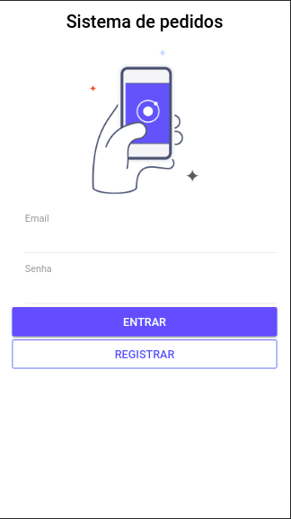
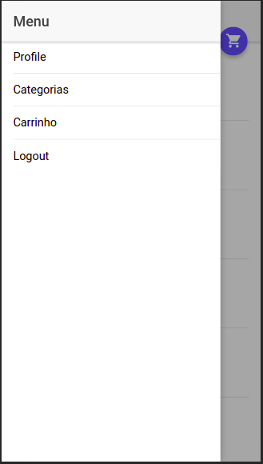
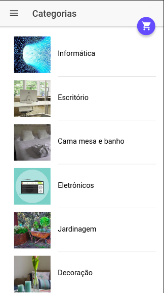
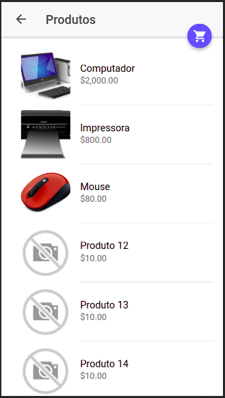
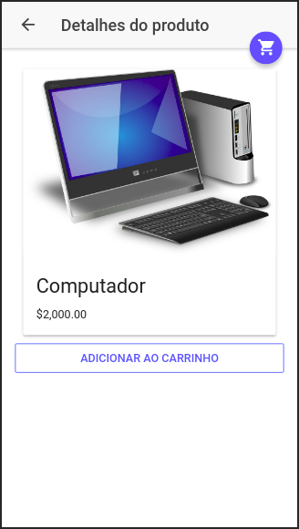
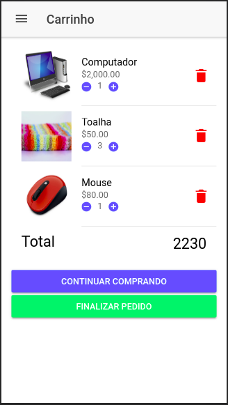
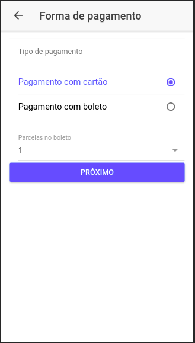
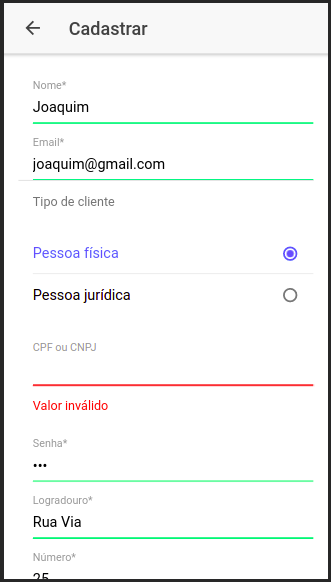

## Frontend

Parte frontend do estudo de caso usando Ionic 3.

### Imagens do app Ionic

Tela de inicial de login

Menu

Lista de categorias de produtos

Lista de produtos da categoria Informática

Detalhes de um produto qualquer selecionado

Tela de carrinho de compras com alguns produtos selecionados

Formas de pagamento

Conferir pedido de compra

Pedido registado com sucesso

Carrinho vazio

Tela de cadastro de usuários

